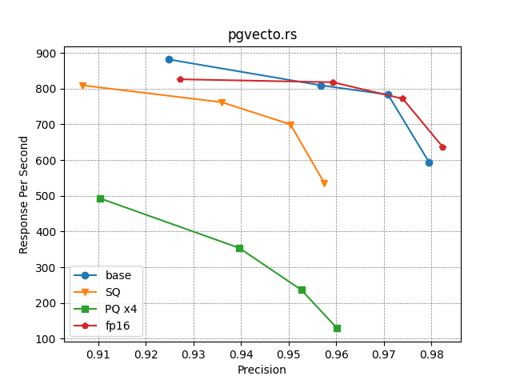

# Benchmark

`pgvecto.rs` has been focused on performance from the beginning. We have continuously monitored the performance of `pgvecto.rs` and compared it with other vector search libraries. The following benchmark results are from January 2024.

The test is done on Google Cloud [n2-standard-8](https://cloud.google.com/compute/docs/general-purpose-machines#n2_series) (8 vCPUs, 32 GB RAM) with the `laion-768-5m-ip` dataset.

## `pgvecto.rs` v.s. `pgvector`

With the HNSW index, `pgvecto.rs` can achieve **2.5x** responses per second as `pgvector` can do with a slightly better precision of around 97%. This advantage increases when higher precision is required.

When the `vbase` mode is enabled, `pgvecto.rs` can achieve over **2x** more responses per second compared to `pgvector` on various filter probabilities.

## `pgvecto.rs` with different quantization methods

`pgvecto.rs` supports several [quantization methods](../usage/quantization.md) and different low precision [indexing](../usage/indexing.md). These methods can help to reduce memory usage at different scales. The following figure shows the performance of `pgvecto.rs` with different quantization methods.

